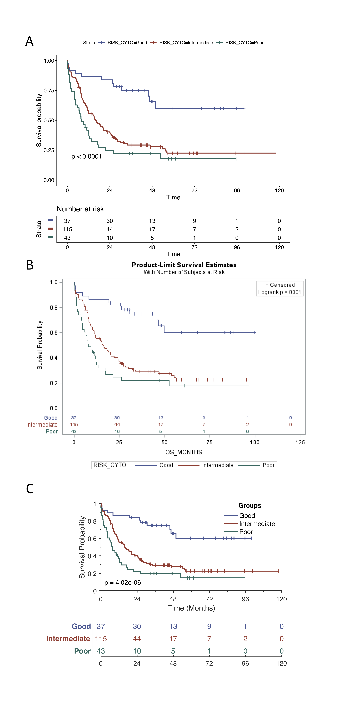

# Summary

Survival analysis is a set of methods for evaluating time-to-event
data that is widely applied across research disciplines. For example,
it is commonly used in clinical trials to compare the effect of treatments.
In cancer biology, it can be used to understand how low- or high-expression
of genes affect the aggressiveness of the tumor. Time-to-event data 
frequently include censored data points, samples where no event was observed.
An event is, for example, death, relapse of disease, or a new metastatic tumor.
If none of these events occur during the study period, the time to-to-event is
unknown, we only know that no events were observed during the study time.
The methods described below were developed for this kind of data.  For an
in-depth introduction to survival analysis, we can recommend the book by
Kleinbaum and David [@Kleinbaum1998]. In fact, much of the code used in MatSurv is
based on the equations given in the book. Commonly 
reported elements of survival analysis include log-rank tests, hazard
ratios (HR) and Kaplan-Meier (KM) curves. KM-curves are used to compare
survival durations between two or more groups and give users a particular
estimate of survival probability at a given time; log-rank tests are
used to conduct statistical inference on survival durations between
groups; and HRs provide a ratio of the hazard rates between groups. 
To further improve the KM-plot, it has been suggested that the KM-plot
should always be accomplished by a table that describes the number of
patients that are still “at-risk” at a specific timepoint [@morris2019]. 
MATLAB [@MATLAB:2019] currently lacks functions to easily create
KM-plots with accompanying risk tables. Furthermore, MATLAB does not
have a built-in log-rank test, nor is one available in any of the
existing toolboxes, including the Statistics and Machine Learning
Toolbox. The Statistics and Machine Learning Toolbox support Cox proportional
hazards regression using the *coxphfit* function and KM-plots can be created using
the *plot* or *stairs* functions. Our goal for MatSurv is to provide an easy-to-use tool that
creates publication quality KM-plots with corresponding risk tables. The
statistical procedures built into MatSurv can be used to compare two or
multiple groups. In addition, MatSurv allows the user to easily modify
the appearance of the created figure. The graphics were inspired by the
`survminer` R-package [@survminer].

# MatSurv Use and Features

MatSurv creates three different items, a KM-plot, a risk table and
statistical results. The KM-plot shows the events and also censoring
for the different groups and it is customizable using different input
parameters. The risk table shows the number of patients “at-risk” for
different time points and it is linked to the KM-plot. The statistical
results are reported as a structure and the different values are described
below. MatSurv uses the log-rank (Mantel-Cox) test to calculate the Chi-
squared test statistic and corresponding p-value describing evidence against
the null hypothesis that the curves are identical.
Users have two options for calculating HRs: the log-rank
or Mantel-Haenszel approach. HR can only be calculated when there are two
groups being compared. In the log-rank approach, HR =
(O<sub>a</sub>/E<sub>a</sub>)/(O<sub>b</sub>/E<sub>b</sub>), where
O<sub>a</sub> & O<sub>b</sub> are the observed events in each group and
E<sub>a</sub> & E<sub>b</sub> are the number of expected events. In the
Mantel-Haenszel approach, HR = exp((O<sub>1</sub>-E<sub>1</sub>)/V),
where O<sub>1</sub> is the number of observed events in a group,
E<sub>1</sub> is the expected number of events in the same group and V
is the total variance. The two methods give similar results but the log-rank
results will not work of there is no events in one of the groups. The 95%
confidence interval for the HR’s are also reported together with the inverse
 of all the values.

In order to use MatSurv, simply put MatSurv.m in any directory of your
choice and make sure it is added to your path. At a minimum, the user
should provide `TimeVar`, a vector with numeric time to event, either
observed or censored, `EventVar`, a vector or cell array defining events
or censoring, and `GroupVar`, a vector or cell array defining the
comparison groups (see example code below).

```
[p,fh,stats]=MatSurv([], [], [], 'Xstep', 4, 'Title', 'MatSurv KM-Plot');

```

The function returns three pieces `p`, the log-rank p-value, `fh`, the
KM-plot figure handle, and `stats`, which are additional statistics from
the log-rank test. The user can further customize the style of their
KM-plot (line colors, labels, ticks, etc.) by making changes to the
figure handle.

When MatSurv is creating the groups based on the median value, the
default option uses values less than the median compared to all other
values, however this is a parameter that can be changed by the user.

The MatSurv software has no dependencies on toolboxes and runs
completely on base MATLAB functions.

# Comparison

The MatSurv output is comparable to that from `proc lifetest` in SAS and
`ggsurvplot` in R. Code for reproducing similar output in R and SAS are
shown below as well as the output from all 3 statistical programs (R,
SAS and MatSurv). The data used is from a classic and frequently used
example by Freireich [@freireich]. In addition, we have also used
the Acute Myeloid Leukemia (LAML) dataset [@laml] from The Cancer
Genome Atlas (TCGA). The following examples, use three different risk
groups as well as the effect of HGF gene expression has on survival.

### R

```
fit <- survfit(survobj ~ RISK_CYTO, data=dat)

ggsurvplot(fit,
     risk.table=TRUE,
     pval=TRUE,
     risk.table.y.text.col=TRUE,
     risk.table.y.text=FALSE,
     palette = c("#445694", "#A23A2E", "#01665E"),
     break.time.by=24)
```

### SAS

```
proc lifetest data=lamlv2(where=(RISK_CYTO ^= 'N.D.')) 
intervals=(0 to 120 by 24) timelist = (0 to 120 by 24)  
plots=survival(atrisk=0 to 120 by 24 test);
time OS_MONTHS*Surv(0);
strata RISK_CYTO/test=logrank;
run;
```

### MatSurv

```
load laml_RC_data.mat

[p,fh,stats]=MatSurv(laml_RC_TimeVar, laml_RC_EventVar,
  laml_RC_GroupVar,... 'GroupsToUse',
   {'Good', 'Intermediate', 'Poor'}, 'Xstep', 24,…
'LineColor',[0.2667,0.3373,0.5804;0.6353,0.2275,0.1804;0.0039,0.4000,0.3686]);
```



The results from MatSurv have been compared against both SAS and R and
found to return similar estimates. The Chi-Sq values and p-values for a
log-rank test in MatSurv, SAS, and R are provided below (Table 1).

| Data      | Groups        |MatSurv|MatSurv |SAS    | SAS    |Survminer| Survminer|
|:---------:| :------------:|:-----:|:------:|:-----:|:------:|:-------:|:--------:|  
|           |               |chi-sq |p       |chi-sq |p       |chi-sq   |p         |
| Freireich | Groups        |16.79  |4.17E-5 |16.79  |4.17E-5 |16.8     |4.17E-5   |
| LAML      | RISK_CYTO     |24.85  |4.02E-6 |24.85  |< 0.001 |24.8     |4.02E-6   |
| LAML      | HGF Median    |6.63   |0.01    |6.63   |0.01    |6.6      |0.01      |
| LAML      | HGF Quartiles |13.01  |3.09E-4 |13.01  |3.09E-4 |13.0     |3.09E-4   |
| LAML      | HGF [6,12]    |16.78  |2.27E-4 |16.78  |2.27E-4 |16.8     |2.24E-4   |


# Acknowledgements

This work was supported in part by NCI Cancer Center Support Grant (P30-CA076292). 
Patrick Leo, CCIPD, for contributing to this project.

# References
